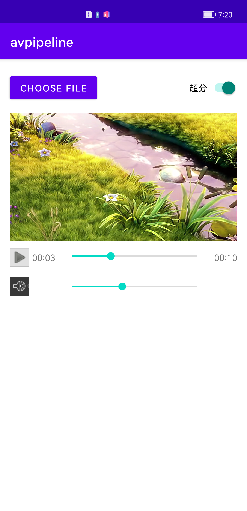

# HMS Core AV Pipeline Kit Sample Code (Java)

English | [中文](README_ZH.md) 

## Contents
 * [Introduction](#Introduction)
 * [Quick Tutorial](#Quick-Tutorial)
 * [Supported Devices](#Supported-Devices)
 * [Running the Demo](#Running-the-Demo)
 * [Result](#Result)
 * [License](#License)

## Introduction
AV Pipeline Kit is a system for easier media app development. It contains a framework that parses plugin orchestration logic from each configuration file to create a pipeline with capabilities such as media playback, recording, or editing. Each plugin in a pipeline undertakes specific tasks, for example, demuxing, decoding, and filtering.
AV Pipeline Kit presets pipelines for scenarios like video playback, video super-resolution, and sound event detection, and it provides Java APIs for you to use these pipelines. You can also call a single preset plugin directly through C++ APIs. If you want to achieve more functions other than those provided by the preset plugins or pipelines, you can even customize some plugins or pipelines based on your own needs.

## Quick Tutorial
1. Install Android Studio on your computer.
2. Open the sample code in Android Studio, compile the code, and run the demo app on an Android device.

## Supported Devices
Phones running Android 9.0 or later

## Running the Demo
Tap **CHOOSE FILE** on the upper left corner. Then, the **external storage** icon will display and you can select a local file. If the icon does not display, tap **show external storage** on the upper right corner of the screen.

## Result

## License
The sample code is licensed under [Apache License 2.0](http://www.apache.org/licenses/LICENSE-2.0).

