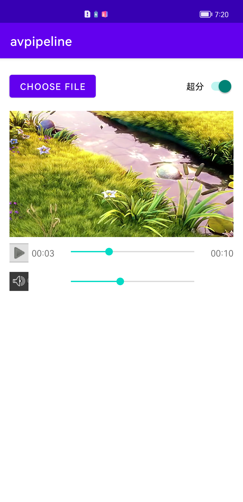

# 华为多媒体管线服务Java示例代码

[English](README.md) | 中文

## 目录
 * [简介](#简介)
 * [快速上手](#快速上手)
 * [支持的设备](#支持的设备)
 * [结果](#结果)
 * [许可证](#许可证)

## 简介
多媒体管线服务（AV Pipeline Kit，简称AV Pipeline）是一个用于创建媒体应用的框架，负责解析配置文件并将多个插件按照配置文件中的编排关系连接组成一个Pipeline，实现特定的媒体业务（例如播放、录制、编辑等）。其中，每个插件负责完成特定的任务，例如解封装、解码、滤波等。
AV Pipeline Kit已预置可应用在播放场景的Pipeline（例如视频播放、视频超分、声音事件检测），并对外封装成了Java接口供开发者使用。同时，也支持开发者通过C++接口直接调用单个插件。若预置插件或预置Pipeline不满足使用要求，开发者可以自定义插件、自定义Pipeline。

## 快速上手
1. 检查您的Android studio开发环境是否已准备好。
2. 在Android studio中打开此示例代码，编译并运行在您的安卓设备上。

## 支持的设备
安卓手机（安卓 9.0及以上版本）

## demo apk使用说明
在选择文件的页面，需要点击页面左上角的按钮，从“内部存储空间”来选择。如果侧边栏中没有内部存储空间，则需要点击页面右上角，点击“显示内部存储空间”。

## 结果

## 许可证
该示例代码已获取了Apache 2.0许可证(http://www.apache.org/licenses/LICENSE-2.0)
